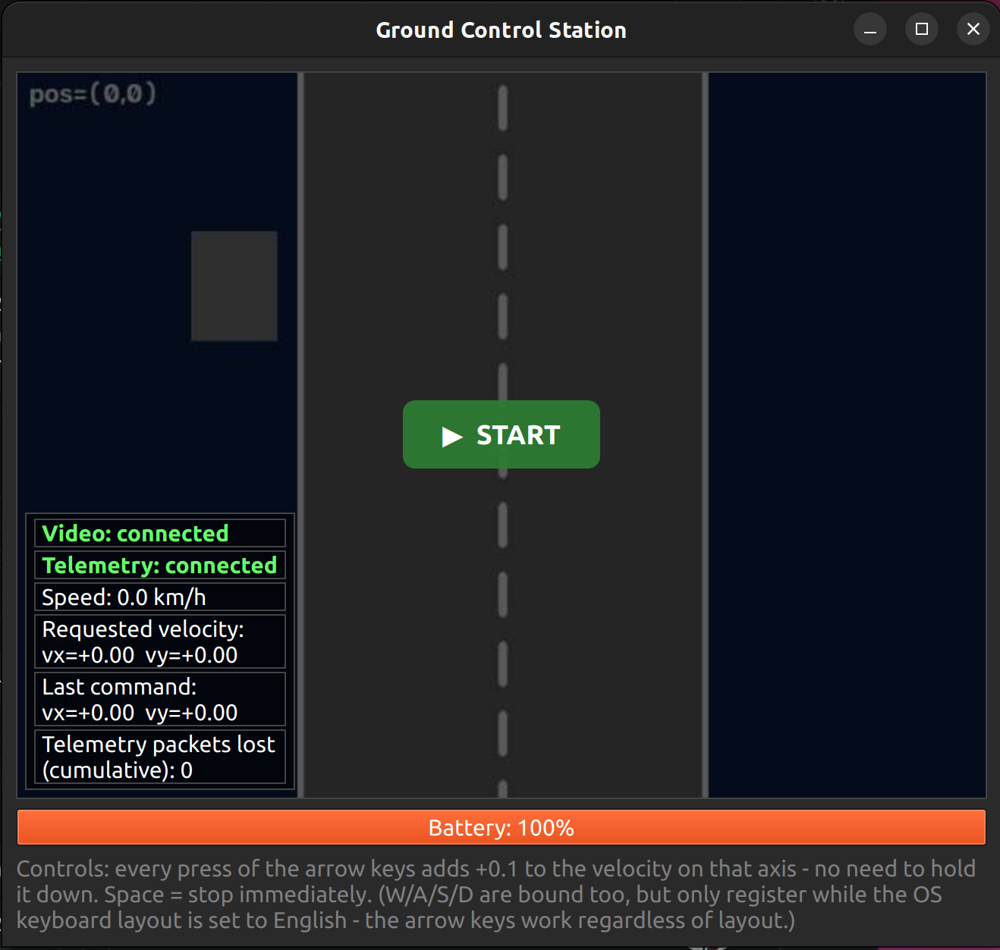
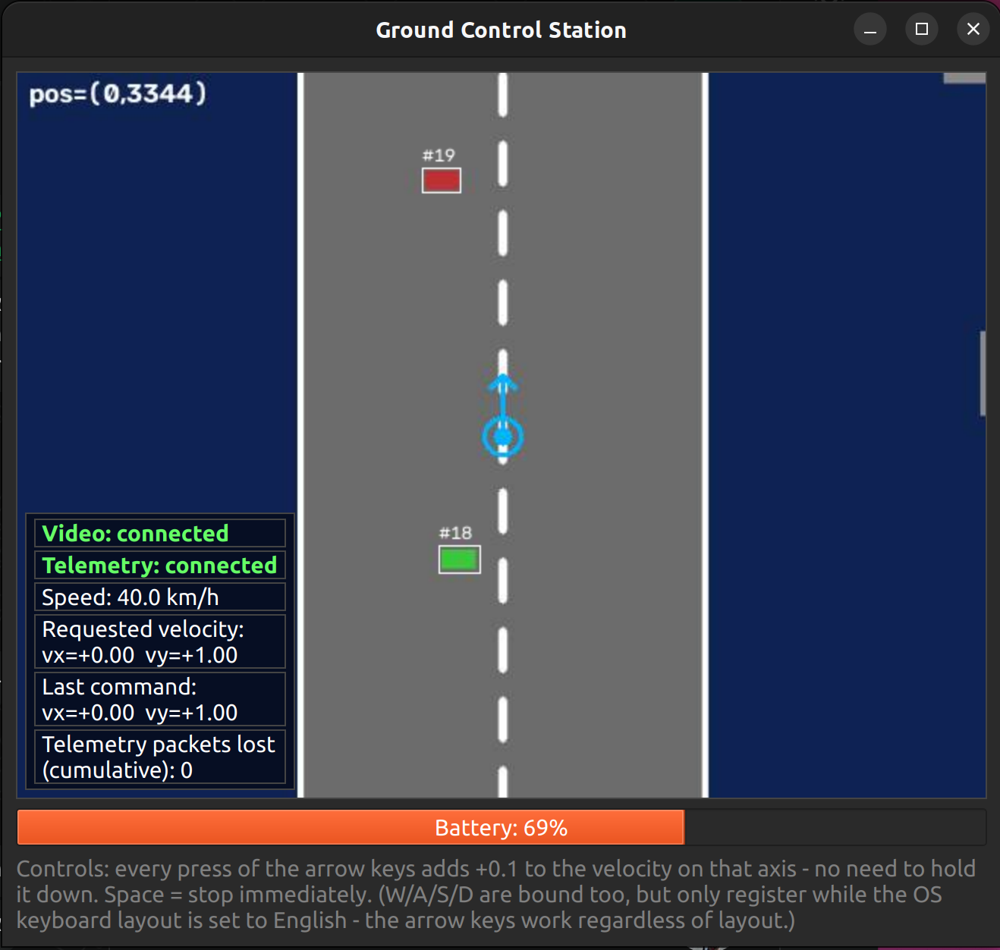

# Simulated Drone & Control Station

A drone simulator and its ground control station, talking to each other over the network like a
real drone would: the **drone** (Server) owns a simulated world, flies through it in response to
commands, and streams back a live first-person video feed plus telemetry (position, speed,
battery). The **Ground Control Station** (Client) is the operator's cockpit — it renders that
video feed, displays the telemetry on a live dashboard, and lets you actually fly the drone with
the keyboard. On top of that, the GCS also detects and tracks moving cars in the video feed in
real time, as a small computer-vision layer on top of the core simulation.

This document explains what's in this repository, what needs to be installed, and the exact
steps to build and run it.

<!-- TODO: replace YOUR_VIDEO_ID below with the real YouTube video id once the demo is recorded and uploaded -->
[](https://www.youtube.com/watch?v=0bZosVkKMuE)




> **Prerequisites, at a glance:**
> - **Python 3.10+**
> - Dependencies in [`requirements.txt`](requirements.txt): `opencv-python`, `PyQt6`, `numpy`
> - **tmux** (optional — only for the automatic launcher, see Run below)

Tested on **Ubuntu 22.04.5 LTS**.

## Build

```bash
git clone https://github.com/talaaron/drone-sim
cd drone-sim
python3 -m venv .venv
source .venv/bin/activate        # Windows: .venv\Scripts\activate
pip install -r requirements.txt
```

Activate the venv in every new terminal you open for this project.

## Run

### Option A — automatic (recommended)

Install tmux first if you don't have it:

```bash
sudo apt-get install tmux    # Ubuntu/Debian
brew install tmux            # macOS
```

Then, with the venv set up (Build above):

```bash
./run_tmux.sh
```

This opens a detached tmux session `Drone-sim` with the drone and GCS each in their own window
(switching replaces the whole view — not a split pane):

```bash
tmux attach -t Drone-sim        # view it
tmux kill-session -t Drone-sim  # stop both nodes
```

Inside: `Ctrl+b n` / `Ctrl+b p` switch windows, `Ctrl+b d` detaches without killing anything.

### Option B — manual (two terminals)

Start the drone first — the GCS needs it up to connect, and the drone learns the GCS's address
from its first incoming command.

**Terminal 1:**
```bash
cd drone-sim
source .venv/bin/activate
python3 -m drone.main
```

**Terminal 2:**
```bash
cd drone-sim
source .venv/bin/activate
python3 -m gcs.main --drone-host 127.0.0.1
```

**Controls:** click START on the video feed, then use the arrow keys to fly (each tap adds
±0.1 to the velocity on that axis; Space stops immediately). W/A/S/D are also bound but only
register under a Latin OS keyboard layout — the arrow keys work regardless of layout.

## Project layout

```
drone/                  Server — the drone simulator
  state.py                thread-safe drone state: position, velocity, battery
  world.py                procedurally-generated static world (road, obstacles)
  cars.py                 spawns moving cars that drive along the road
  render.py               builds each OpenCV top-down video frame
  physics.py               fixed-rate physics tick, decoupled from network send rates
  network.py               CommandReceiver / VideoStreamer / TelemetryStreamer threads
  main.py                  entry point

gcs/                     Client — the ground control station
  video_receiver.py       QThread: reassembles the video feed from UDP chunks
  telemetry_receiver.py   QThread: receives telemetry, detects lost packets
  detector.py              color-based car detector + a simple centroid tracker
  controller.py             turns keyboard input into outgoing UDP commands
  main_window.py            the PyQt6 window: video, dashboard, keyboard handling
  main.py                   entry point

shared/protocol.py       ports, packet formats, encode/decode — imported by both sides,
                          so the two nodes can never drift out of sync with each other

run_tmux.sh              launches both nodes together (see Run, Option A)
requirements.txt         Python dependencies
```
